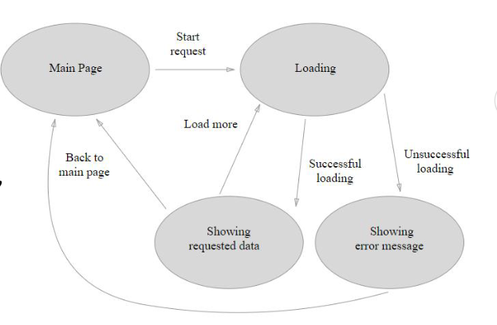
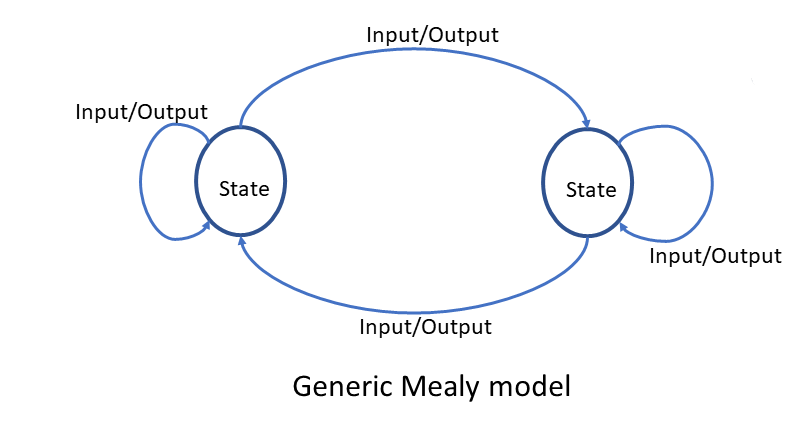
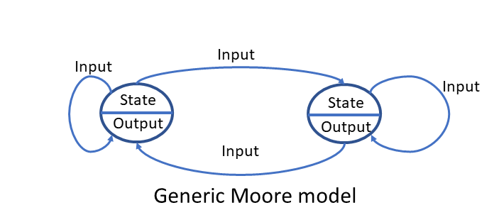
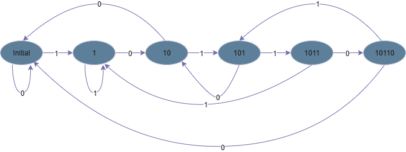

**Version**: 1.0.0
**Author**: Group 5
**Update**: 2025-08-26

# FSM
## Overview
### A. Introduction
The acronym **FSM** stands for **Finite State Machine**. **FSMs** are mathematical models used to represent and control the behavior of systems. They consist of **a finite number of states**, **transitions** between **these states**, and **events** that trigger transitions.



****Figure 1***. FSM Overview*

### B. Mealy and Moore machine 

**Mealy** and **Moore** machines are two different types of Finite State Machines that are commonly used for modeling and designing digital systems. Both types of machines define the behavior and state transitions of a system, but they differ in how they handle outputs.

#### Mealy machine
In this machine, the output produced by the state machine depends on the input events fed to the state machine AND presents an active state of the state machine.
**The output** is **not produced inside the state**.



****Figure 2***. Generic model of the Mealy machine*

#### Moore machine 
In this state machine, the output is determined only by the present active state of the state machine and not by any input events.
**No output during state transition**.



****Figure 3***. Generic model of the Moore machine*

### C. Exercise
FSM detect 10110



# Button Driver
## Button Header File

```C
#ifndef BUTTON_H
#define BUTTON_H

/* Includes ----------------------------------------------------------- */
#include "stm32f4xx_hal.h"

/* Public defines ----------------------------------------------------- */
#define DEBOUND_TIME 20
#define SINGLE_CLICK_TIME 1000
#define DOUBLE_CLICK_TIME 100

/* Public enumerate/structure ----------------------------------------- */
/**
 * @brief case enum
 */

typedef enum
{
  off,         // Case 0: Hold > 3s 
  led1_on,     // Case 1: Click from Case 0 or Double Click fron Case 3
  led2_on,     // Case 2: Double Click from Case 1 
  led3_on      // Case 3: Double Click from Case 2
} case_fsm;

/**
 * @brief button state enum
 */
typedef enum
{
  NO_CLICK = 0,                // Click 0 time
  SINGLE_CLICK = 1,            // Click 1 time
  DOUBLE_CLICK = 2,            // Click 2 times
  LONG_CLICK = 3               // Hold the button
} button_state;

/**
 * @brief button state enum
 */
typedef struct 
{
	GPIO_TypeDef *PORT_BUTTON;  /**User's PORT */
	uint16_t BUTTON_PIN;        /**PORT PIN BUTTON */
	button_state state;         /**Pin's State */
	uint8_t isPress;            /**Check Button's Press State */
	uint16_t timePress;         /**Time when hold the button */
	uint16_t timeDouble;        /**Time when release the button */
} button;

extern button myButton;
extern case_fsm case_itr;

/* Public function prototypes ----------------------------------------- */
button_state button_read(button *Button);


#endif
```
## Button C Source File

```C
/* Includes ----------------------------------------------------------- */
#include "Button.h"

/* Public variables --------------------------------------------------- */
button myButton;
case_fsm case_itr = off;

/* Public function prototypes ----------------------------------------- */
/**
 * @brief  Read button's state
 *
 * @param[in]     button pointer
 * @param[out]    button structure
 *
 * @attention  Define button pointer
 *
 * @return  button_state
 */

button_state button_read(button *Button)
{
  Button->state = NO_CLICK;
  while (HAL_GPIO_ReadPin(GPIOA,GPIO_PIN_0) == 1)  // Button is pressed
  {
    Button->timePress++;  // Increase time when hold the button 
    Button->isPress = 1;
    HAL_Delay(1);
  }
  if (Button->isPress)
  {
    while (HAL_GPIO_ReadPin(GPIOA,GPIO_PIN_0) == 0)  // Stop pressing button
    {
      Button->timeDouble++;	 // Increase time when release the button
      HAL_Delay(1);
      if (Button->timeDouble > DOUBLE_CLICK_TIME)  // Check button's state			
      {
        if (Button->timePress > DEBOUND_TIME && Button->timePress <= SINGLE_CLICK_TIME)	// Press the button 1 time (SINGLE CLICK)
        {
          Button->isPress = 0;
          Button->timePress = 0;
          Button->timeDouble = 0;
          Button->state = SINGLE_CLICK;
          return Button->state;
        }
        else if (Button->timePress > SINGLE_CLICK_TIME)	 // Hold the button (LONG CLICK)
        {
          Button->isPress = 0;
          Button->timePress = 0;
          Button->timeDouble = 0;
          Button->state = LONG_CLICK;
          return Button->state;
        }
      }
    }
    while (HAL_GPIO_ReadPin(GPIOA, GPIO_PIN_0) == 1)  // Press the button 2 times (DOUBLE CLICK)
    {
      Button->state = DOUBLE_CLICK;
      Button->isPress = 0;
      Button->timePress = 0;
      Button->timeDouble = 0;
      return Button->state;
    }
  }
  return NO_CLICK; // Default Button's State
}
```

# LED Driver


