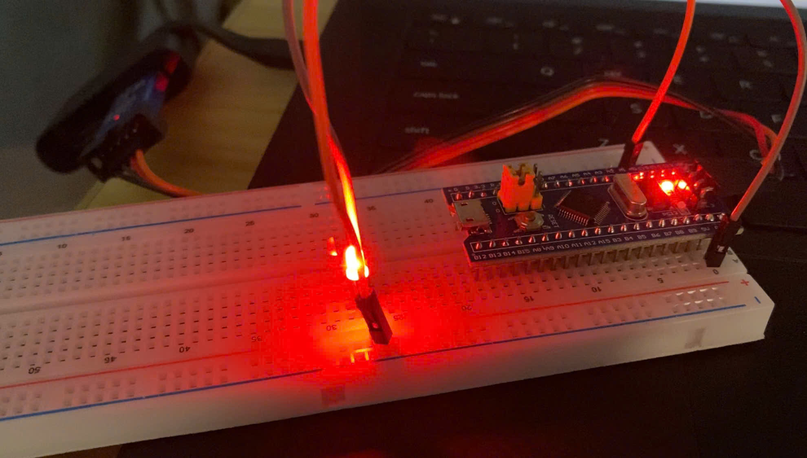
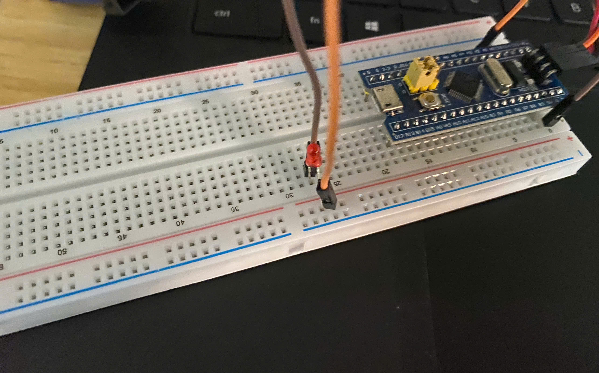
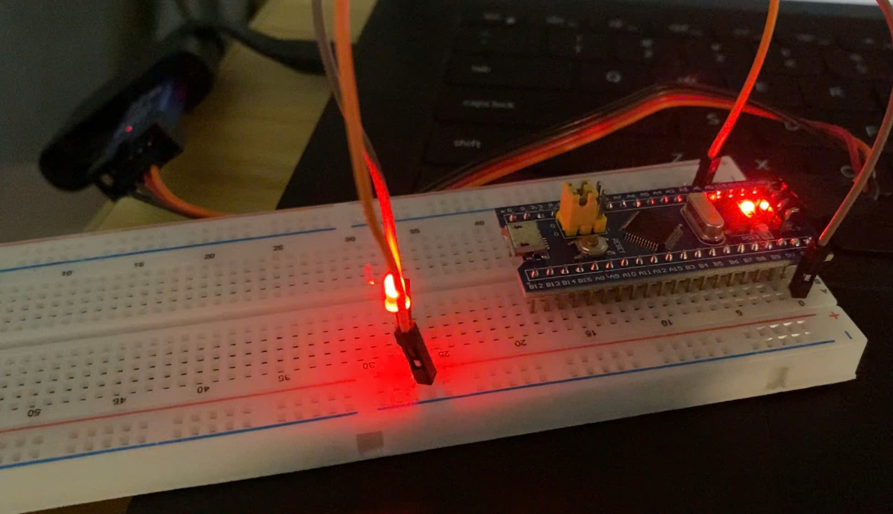

**Version**: 1.0.0  
**Author**: Group 5  
**Update**: 2025-09-04  

# Generate 1Hz Wave to Control LED

<details>
  <summary>Table of Contents</summary>
  <ol>
    <li><a href="#about-the-project">About The Project</a></li>
    <li>
      <a href="#build-instruction">Build Instruction</a>
      <ul>
        <li><a href="#exercise-1-hal-timer">Exercise 1: HAL TIMER</a></li>
        <li><a href="#exercise-2-hal-pwm">Exercise 2: HAL PWM</a></li>
        <li><a href="#exercise-3-led-fade">Exercise 3: LED FADE</a></li>
        <li><a href="#software">Software</a></li>
      </ul>
    <li><a href="#usage">Usage</a></li>
    <li><a href="#result">Result</a></li>
    <li><a href="#acknowledgments">Acknowledgments</a></li>
  </ol>
</details>

## About The Project
This project includes three exercises that demonstrate how to control an **LED** on the **STM32F103C8T6** board using the HAL library:

**HAL TIMER** – Configure a hardware timer in interrupt mode to generate a 1 Hz square wave, toggling the RGB LED ON/OFF.

**HAL PWM** – Use a timer in PWM mode to automatically create a 1 Hz signal with 50% duty cycle for LED control.

**LED Fade (PWM Timers)** – Apply PWM with a higher frequency and adjust duty cycles gradually to produce a smooth fading effect on the RGB LED.

Through these exercises, the project provides a clear introduction to:
- Using **HAL Timers** for periodic interrupts.
- Configuring **PWM channels** for both low-frequency blinking and high-frequency brightness control.
- Building modular STM32 projects with a separation between **application code** and **driver layers**.

## Build Instruction

### Exercise 1: HAL TIMER
- **Description**
  - Use the STM32F103C8T6 HAL TIMER library to generate a 1Hz square wave.
  - The 1Hz signal is used to toggle the LED on and off.

- **Hardware**
  - Board: STM32F103C8T6 (Blue Pill)
  - LED connected to GPIO pins:
    - LED + → PB0
    - LED - → GND

- **Software configuration**

- **Timer Configuration**
  - System Clock: 72 MHz
  - Target Frequency: 1 Hz
  - Prescaler (PSC): To get 1Hz from 72MHz
   ```sh 
    Timer frequency = 72,000,000 / (PSC + 1) / (ARR + 1)
      Choose PSC = 7199, ARR = 9999
    72,000,000 / (7199 + 1) / (9999 + 1) = 1 Hz
    ```
- **Code Placeholder:**
    ```c
    void HAL_TIM_PeriodElapsedCallback(TIM_HandleTypeDef *htim)
    {
      if (htim->Instance == htim1.Instance)
      {
        HAL_GPIO_TogglePin(GPIOA, GPIO_PIN_0);
      }
    }
    int main()
    {
      HAL_TIM_Base_Start_IT(&htim1);
    }
    ```

### Exercise 2: HAL PWM
- **Description**
  - Use the STM32F103C8T6 HAL PWM library to generate a 1Hz PWM signal.
  - The PWM output is used to control the RGB LED (on/off at 1Hz).

- **Hardware**
  - Board: STM32F103C8T6 (Blue Pill)
  - LED connected to GPIO pins:
    - LED + → PB0
    - LED - → GND
    
- **Software configuration**

- **Timer Configuration**
  - **System Clock:** 72 MHz
  - **Target Frequency:** 1 Hz
  - **Prescaler (PSC):** 7199
  - **Duty Cycle:** 50% duty
        CCR = ARR / 2 - 1 = 5000 - 1 = 4999

### Exercise 3: LED FADE
- **Description**
  - Use PWM timers to gradually increase and decrease the brightness of the RGB LED (fade effect).

- **Hardware**
  - Board: STM32F103C8T6 (Blue Pill)
  - LED connected to GPIO pins:
    - LED + → PB0
    - LED - → GND

- **Software configuration**


- **Timer Configuration**
  - **System Clock:** 72 MHz
  - **PWM Frequency:** 72 kHz (Timer frequency = 72,000,000 / (PSC + 1) / (ARR + 1))
- **Code Placeholder:**
    ```c
    HAL_TIM_PWM_Start(&htim2, TIM_CHANNEL_1);
    while (1)
    {
      for(int i = 0; i < 100; i++)
      {
        __HAL_TIM_SET_COMPARE(&htim2, TIM_CHANNEL_1, i);
        HAL_Delay(5);
      }
      for(int i = 99; i >= 0; i--)
      {
        __HAL_TIM_SET_COMPARE(&htim2, TIM_CHANNEL_1, i);
        HAL_Delay(5);
      }
    }
    ```

### Software
- **STM32CubeMX**: A hardware configuration tool that automatically generates HAL code for peripherals such as GPIO, EXTI, and TIM, helping to shorten development time.

- **Keil µVision 5**: An integrated development environment (IDE) for ARM, supporting compilation, programming, and debugging for STM32.

- **STM32CubeF4 HAL Library**: A hardware abstraction library provided by ST, making peripheral operations easier, increasing compatibility, and reducing errors from direct register programming.


## Usage
**Directory Tree**
```C

├─ Application/User/Core
│  ├─ main.c
|  └─ ...
├─ Driver/            
│  ├─ CMSIS/...
│  └─ STM32F4xx_HAL_Driver/...
├─ images/
│  └─ ...
|
└─ README.md
```

**Operations with Keil C**
After configuring and generating code from **STM32CubeMX**, open the project in **Keil C**.
Navigate to the file main.c located under **Application/User**.

 - Use the **Build (F7)** button to compile the program.

 - Use the **Load (F8)** button to flash the program to the board.


***Notes when flashing the program***

Click on the Option for Target icon (or go to Project → Option for Target) to perform several necessary configurations:

 - In the Option for Target window, select the Debug tab and tick Use ST-Link Debugger in order to download the program to the development board.
(If you choose Use Simulator, the program will only run in simulation mode.)

 - Click Settings next to Use: ST-Link Debugger. In the Cortex-M Target Driver Setup window, go to the Flash Download tab:

    - If you tick Reset and Run, the program will automatically run right after flashing.

    - If you do not tick this option, after flashing you will need to press the Reset button on the board to start the program.


## Result
**Exercise 1 & Exercise 2:** LED ON/OFF every 1 second

In these exercises, the LED is controlled to turn ON and OFF alternately with a period of 1 second. The observed result is that the LED turns ON for 1 second, then OFF for 1 second, and this cycle repeats continuously. This is illustrated by the following images:

- **LED_ON.jpg**: The LED is fully ON.
- **LED_OFF.jpg**: The LED is completely OFF.

| State   | Image                                 |
|---------|----------------------------------------|
| LED ON  |   |
| LED OFF | |
---
**Exercise 3:** LED gradually brightens and dims (ON → MEDIUM → OFF)

In this exercise, the LED is controlled to change its brightness, the light gradually brightens and then dims continuously. This process repeats, creating a fading effect from bright to dim. The results are shown in the following images:

- **LED_ON.jpg**: The LED is at maximum brightness.
- **LED_MEDIUM.jpg**: The LED is at medium brightness.
- **LED_OFF.jpg**: The LED is completely OFF.

| State        | Image                                         |
|--------------|-----------------------------------------------|
| LED ON       |          |
| LED MEDIUM   |  |
| LED OFF      |        |

---
## Acknowledgments
* [KeilC](https://www.keil.com/demo/eval/arm.htm)
* [STM32F1 Reference manual](https://www.st.com/resource/en/reference_manual/rm0008-stm32f101xx-stm32f102xx-stm32f103xx-stm32f105xx-and-stm32f107xx-advanced-armbased-32bit-mcus-stmicroelectronics.pdf)
* [STM32F103C8T6 Datasheet](https://www.alldatasheet.com/datasheet-pdf/pdf/201596/STMICROELECTRONICS/STM32F103C8T6.html)
* [STM32F103C8T6 schematic](https://stm32-base.org/assets/pdf/boards/original-schematic-STM32F103C8T6-Blue_Pill.pdf)